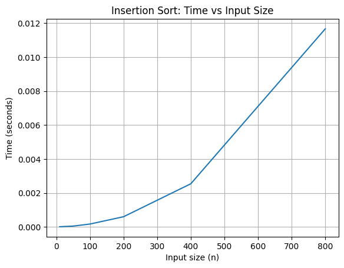
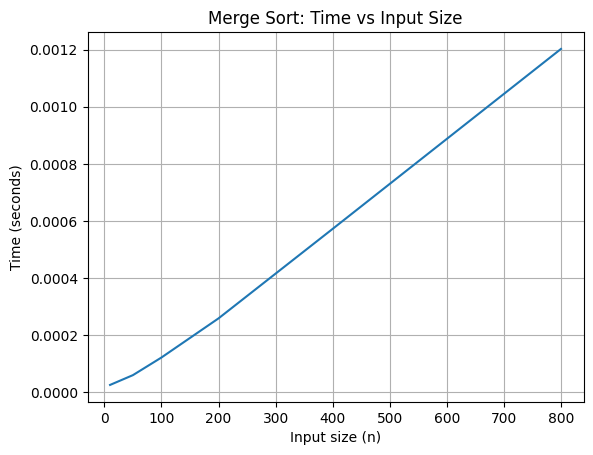
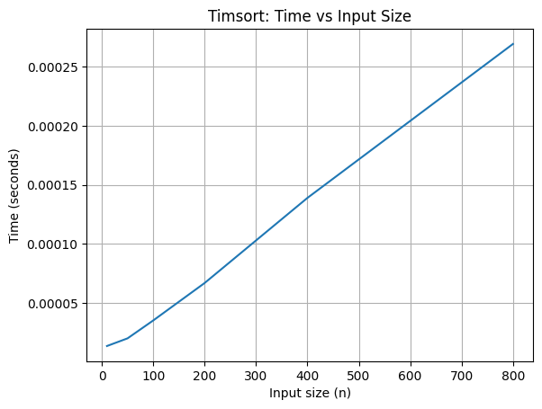
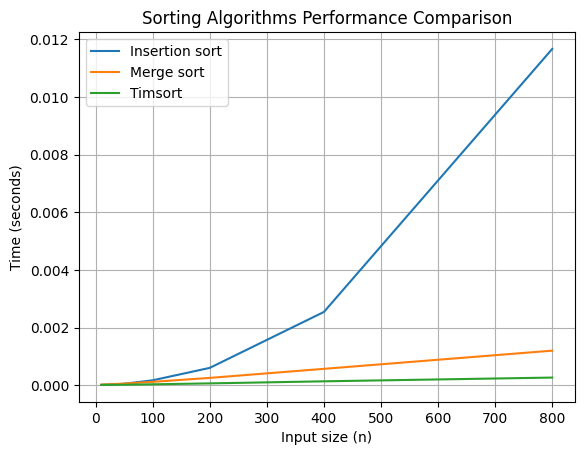

### Insertion:

Розглянемо час витрачений алгоритма вставки в залежності від кількості переданих айтемів:
| Count (n) | Time (seconds) |
|-----------|----------------|
| 10  | 0.0000163340 |
| 50  | 0.0000536250 |
| 100 | 0.0001742500 |
| 200 | 0.0006052090 |
| 400 | 0.0025455830 |
| 800 | 0.0116687910 |

Як видно з графіка - він має чітку структуру параболи що відповідає операційній складності O(n^2)

### Merge:
Тепер візьмемо алгоритм злиття і виконаємо сортування при тих самих параметрах:
| Count (n) | Time (seconds) |
|-----------|----------------|
| 10  | 0.0000246250 |
| 50  | 0.0000589170 |
| 100 | 0.0001207500 |
| 200 | 0.0002579580 |
| 400 | 0.0005718340 |
| 800 | 0.0012027920 |

З графіку видно що зростання часу повільніше ніж у Insertion, і при зростанні кількості даних час збільшується приблизно в 2 рази

### Timsort
Останнім розглянемо гібридний алгоритм сортування.
| Count (n) | Time (seconds) |
|----------:|---------------:|
| 10  | 0.0000138750 |
| 50  | 0.0000203340 |
| 100 | 0.0000354580 |
| 200 | 0.0000670830 |
| 400 | 0.0001389580 |
| 800 | 0.0002690000 | 

Видно що крива росте майже лінійно, і час не збільшується так швидко як у merge

### All
Якщо розглянути всі дані на одному графіку видно

як бачимо з графіка при тій самій кількості вхідних даних крива timsort має найменший нахил, що свідчить про найшвидший спосіб сортування. При цьому insertion росте найшвидше.
Отже можемо сказати, що Timsort є найефективнішим і має вигляд графіка близького до лінійного.